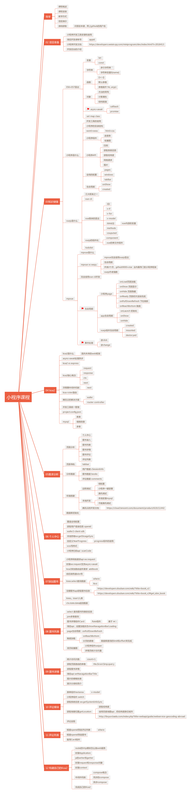

# weapp-snail-books
微信小程序--蜗牛图书

期待录制一个好课程 欢迎大家follow

## 项目目录介绍

* 01 第一章ppt
* 02 第二章ppt
* 03 第三章ppt和代码
  - es6  es6语法代码
  - vue-demo vue语法代码
  - mpvue-demo  mpvue todolist代码
* 04 第四章ppt和代码
* 05 第五章ppt和代码
* 06 第六章代码
* 07 第七章代码
* 08 第八章代码
* 09 第九章代码
* 10 第十章代码
* 11 第十一章代码
  - woa 构建自己的koa
* 12 第十二章ppt（更新完毕后上传）
* img 导航图片

## 项目常用资源下载

* github desktop桌面软件
* 小程序开发者工具
* 评级组件来源[tiny-rate](https://github.com/shengxinjing/tiny-rate)
* 评级符号 ★☆
* [图书的isbn码图片](./other/图书二维码)

## 常用链接

* [github](http://github.com/)
* [电脑生成新的sshkey](https://help.github.com/articles/generating-a-new-ssh-key-and-adding-it-to-the-ssh-agent/)
* [github添加ssh-key](https://help.github.com/articles/adding-a-new-ssh-key-to-your-github-account/)
* [小程序帐号注册](https://mp.weixin.qq.com/)
* [小程序开发者文档](https://developers.weixin.qq.com/miniprogram/dev/index.html)
* [豆瓣图书api](https://developers.douban.com/wiki/?title=book_v2#get_isbn_book)
* [百度地图api](http://lbsyun.baidu.com/index.php?title=webapi/guide/webservice-geocoding-abroad)

## 联系我
由于慕课取消了qq群，大家加我微信交流吧 

或者 [知乎](https://www.zhihu.com/people/woniuppp) / [微博](https://weibo.com/woniuppp/home?wvr=5)

## 课程脑图

